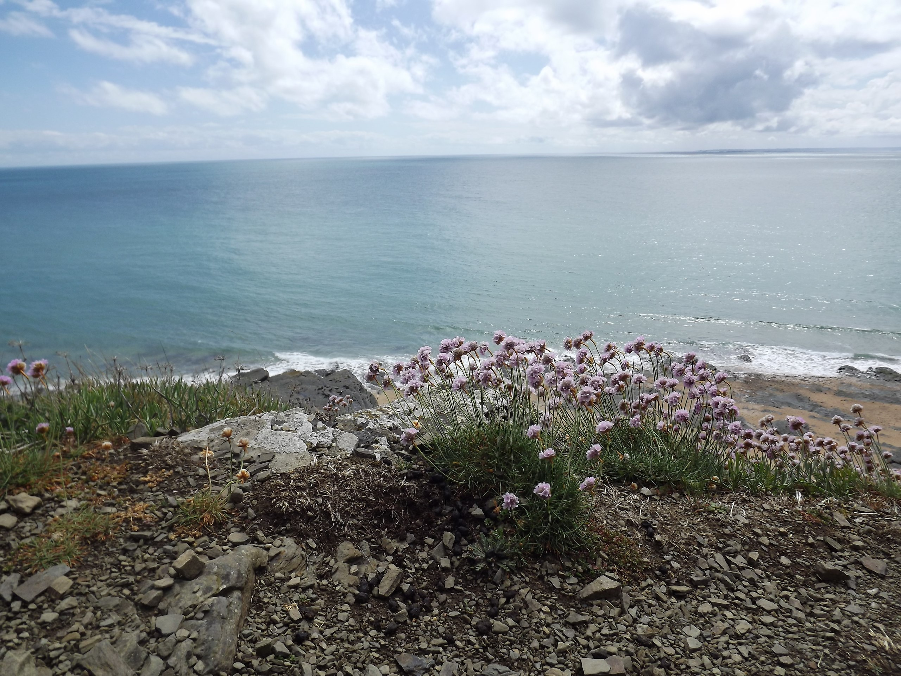
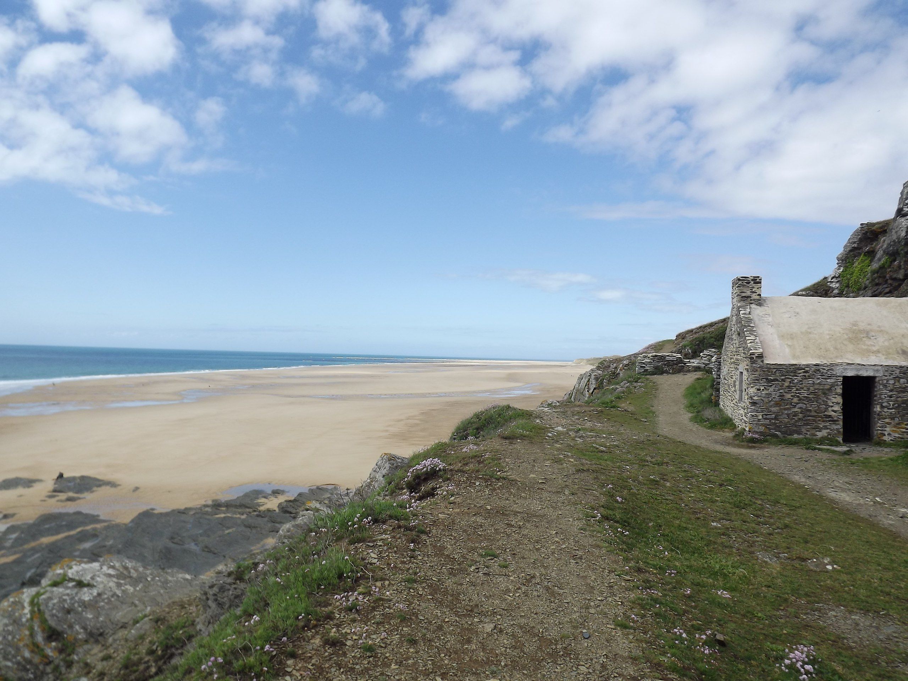
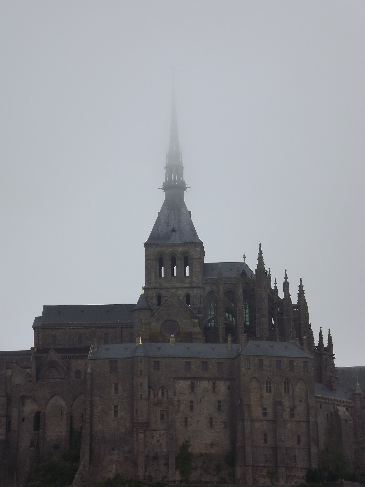

# LA BIBLIOTHEQUE NATIONALE
Le bâtiment de 74 mètres de haut possède près de 19 salles de lecture réparties sur 22 étages.  Au sommet du bâtiment il y a une plate-forme d’observation, qui offre une vue magnifique sur Minsk. Surtout la nuit quand il y a toutes les lumières. Cette terrasse panoramique est ouverte tous les jours de 12h à 23h, la dernière montée se fait à 22h 30.
À proximité de la bibliothèque vous trouvez un grand centre commercial Dana Mall. Juste en face du centre commercial il y a les façades d'immeubles en mosaïque de l'époque soviétique aussi à voir !

# L'EGLISE DE TOUS LES SAINTS 
l’Église-monument de Minsk en l’honneur de Tous les Saints en mémoire des victimes ayant servi au salut de la Patrie est une Église orthodoxe. Monument unique de l'architecture en pierre blanche.

mikä on ranskankielinen teksti, oli karhuja, mikä on ranskankielinen teksti, oli karhuja, mikä on ranskankielinen teksti, oli karhuja,
*прпалрпа*

## ffff

