La capitale de la Biélorussie est une nouvelle destination idéale pour un voyage de découverte. Que faire et que voir lors d’une première visite de la ville ? Voici un tour des 12 sites incontournables de Minsk.
## LA BIBLIOTHEQUE NATIONALE
Le bâtiment de 74 mètres de haut possède près de 19 salles de lecture réparties sur 22 étages.  Au sommet du bâtiment il y a une plate-forme d’observation, qui offre une vue magnifique sur Minsk. Surtout la nuit quand il y a toutes les lumières. Cette terrasse panoramique est ouverte tous les jours.
À proximité de la bibliothèque vous trouvez un grand centre commercial Dana Mall. Juste en face du centre commercial il y a les façades d'immeubles en mosaïque de l'époque soviétique, aussi à voir !
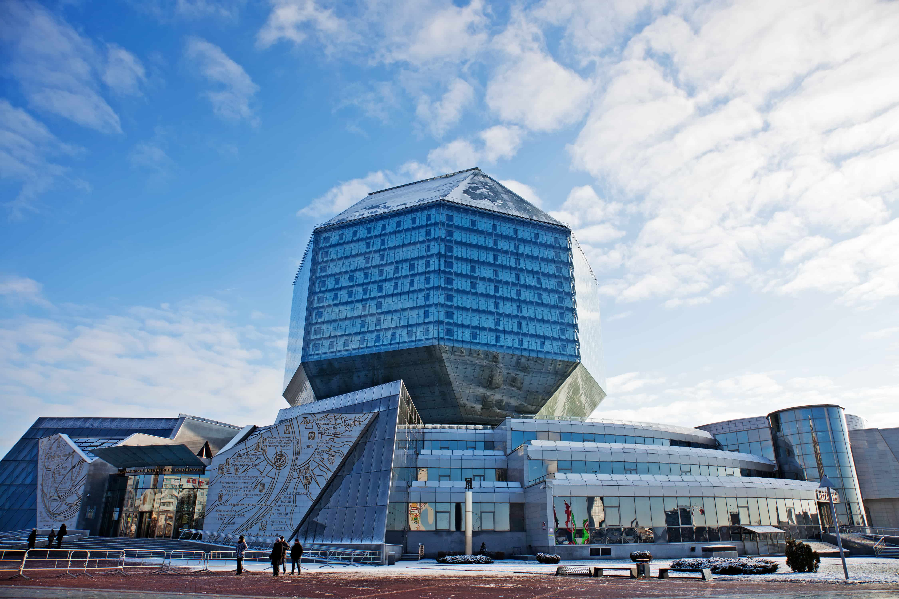
## L'EGLISE DE TOUS LES SAINTS 
l’Église-monument de Minsk en l’honneur de Tous les Saints en mémoire des victimes ayant servi au salut de la Patrie est une Église orthodoxe. Monument unique de l'architecture en pierre blanche.
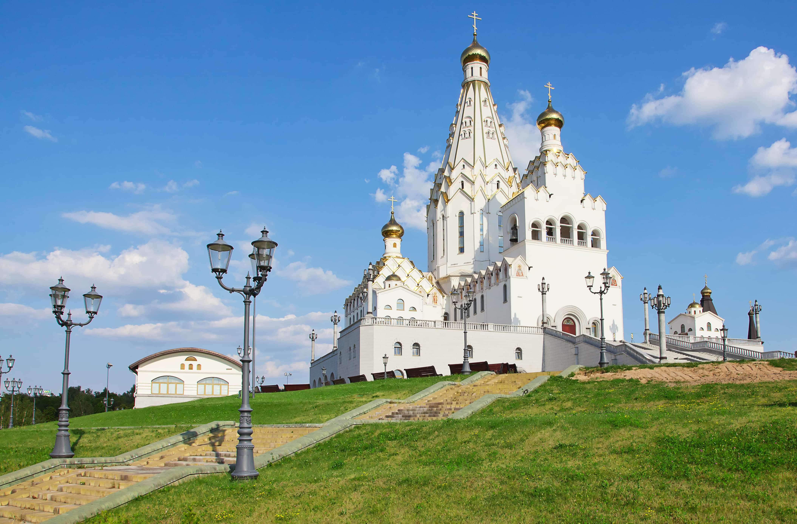
## LE FAUBOURG DE LA TRINITE - AU COEUR DE LA CAPITALE
Il faut marquer que pendant la Seconde Guerre mondiale la capitale a été bombardée par les Allemands, c'est pour ça la ville n'a pas conservé beaucoup de monuments historiques. Le Faubourg de la Trinité est le seul quartier authentique restant suite a la guerre. Aujourd'hui, c'est un quartier touristique préféré. Vous y trouverez de nombreux cafés et restaurants avec une ambiance exceptionnelle. Après vous pouvez vous promener au bord d'un fleuve Svisloch.
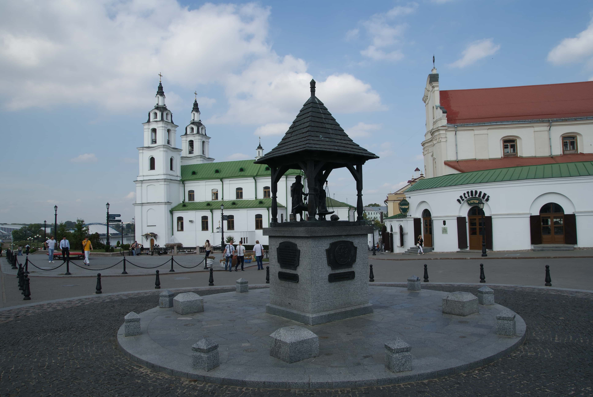
## L'ILE DES LARMES 
Juste en face du Faubourg de la Trinité on découvre l'ile des larmes. 
C`est un mémorial aux soldats morts pendant la guerre d'Afghanistan (1979-1989). Le monument est fait sous la forme d'une petite église avec des statues représentant les mères et les sœurs des disparus. On y voit aussi la statue d'un ange en pleurs. C'est un endroit qui frappe.
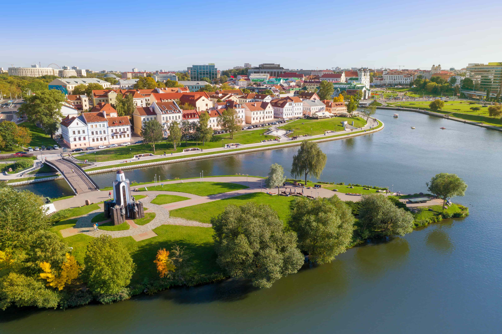
## LA PLACE DE LA VICTOIRE
La place de la victoire est l'une des principales places de Minsk. Au centre de cette place s’élève un monument de 38 mètres de haut. La Flamme éternelle brûle au pied du monument en l'honneur de ceux qui sont morts en défendant la Patrie pendant la Seconde Guerre mondiale.
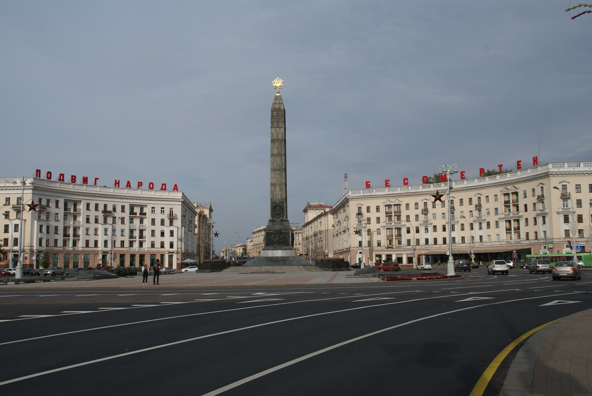
## LA PLACE DE L'INDEPENDANCE
La place de l’Indépendance est la plus grande place de Minsk. On y trouve la statue de Lénine, la maison du gouvernement. Sous la place, sous le sol se trouve un grand centre commercial «Stolitsa» où vous pouvez boire un café acheter des souvenirs, des produits en lin, du chocolat biélorusse «Kammunarka» et d'autres objets avec des symboles nationaux.
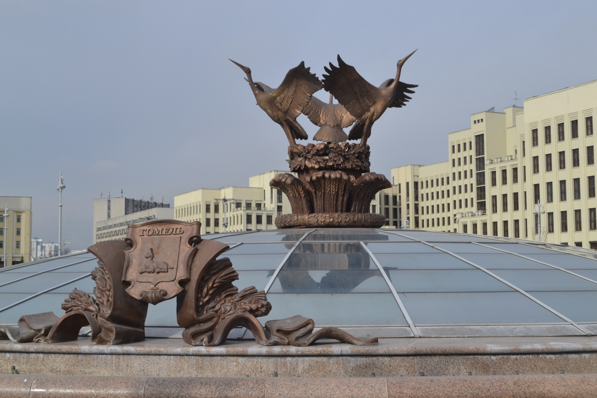
## L'ÉGLISE CATHOLIQUE ROUGE (Église Saint-Siméon-et-Sainte-Hélène)
La cathédrale Saint Siméon et Sainte Hélène (1910) est vraiment impressionnante, on l’appelle l’Eglise rouge, elle a été construite en brique avec des éléments du roman et du gothique. 
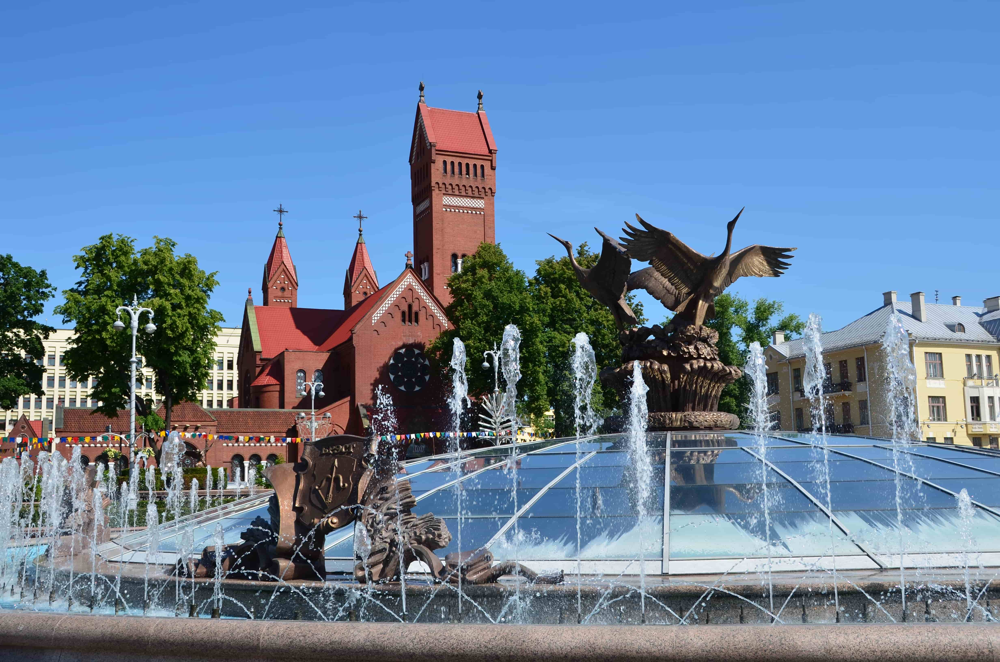
## LE MUSEE NATIONAL DES BEAUX-ARTS
Aujourd’hui c`est le plus grand musée du pays. Il abrite une collection plus de 30 000 œuvres. On y découvre des tableaux, des sculptures et des dessins dédiées à l’art biélorusse ancien et moderne, à l’art russe mais aussi à l’art européen. En parallèle, des expositions temporaires prennent place régulièrement, elles ont pour vocation de compléter les collections permanentes. Si vous aimez l’art, impossible de visiter Minsk sans passer par cet endroit.
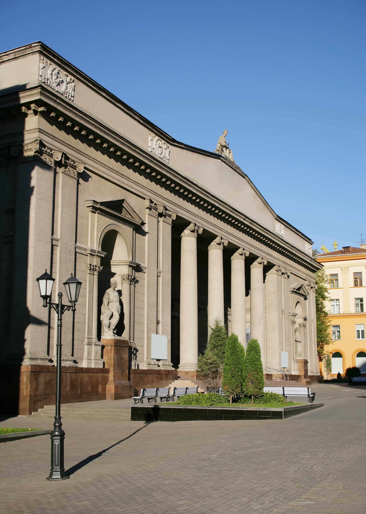
## LA PLACE DU DRAPEAU DE L'ÉTAT 
La place ronde avec un mât portant le drapeau national au milieu. L'étendard mesure 98 mètres et pèse 25 kilos ! Il a été spécialement installé dans cet endroit où le vent souffle constamment. 
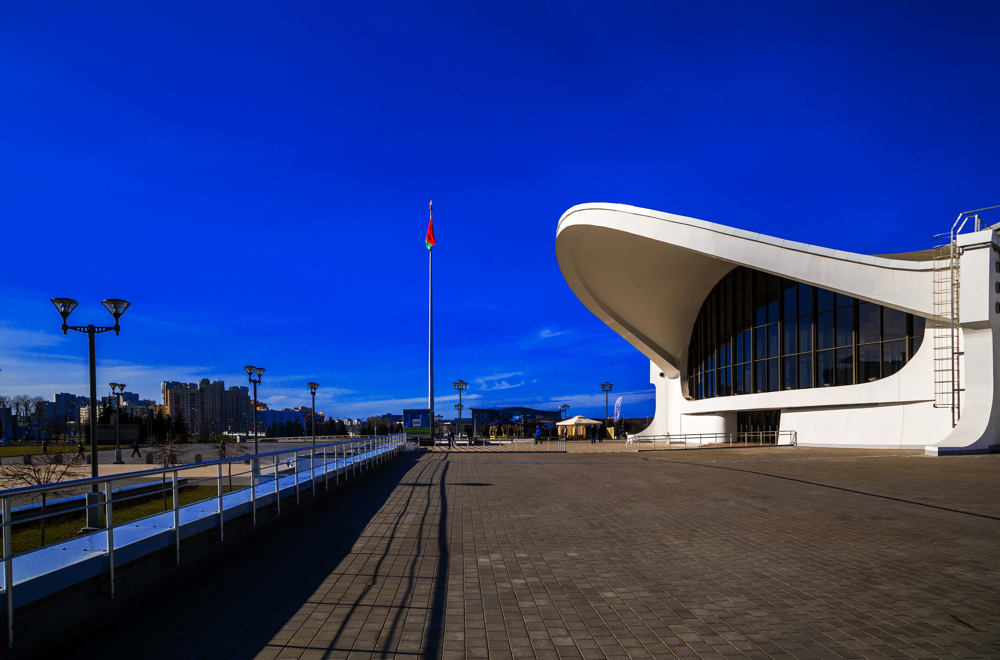
## LE GRAND THEATRE NATIONAL D'OPERA ET DE BALLET
Si vous prenez un billet pour l’opéra ou le ballet vous ne resterez pas indifférent pendant ces quelques heures, vous aurez beaucoup de plaisir ! 
Aussi on peut prendre des belles photos devant le théâtre ou faire un tour dans un petit parc à côté. Si vous aimez le théâtre, impossible de ne pas passer par ce lieu.
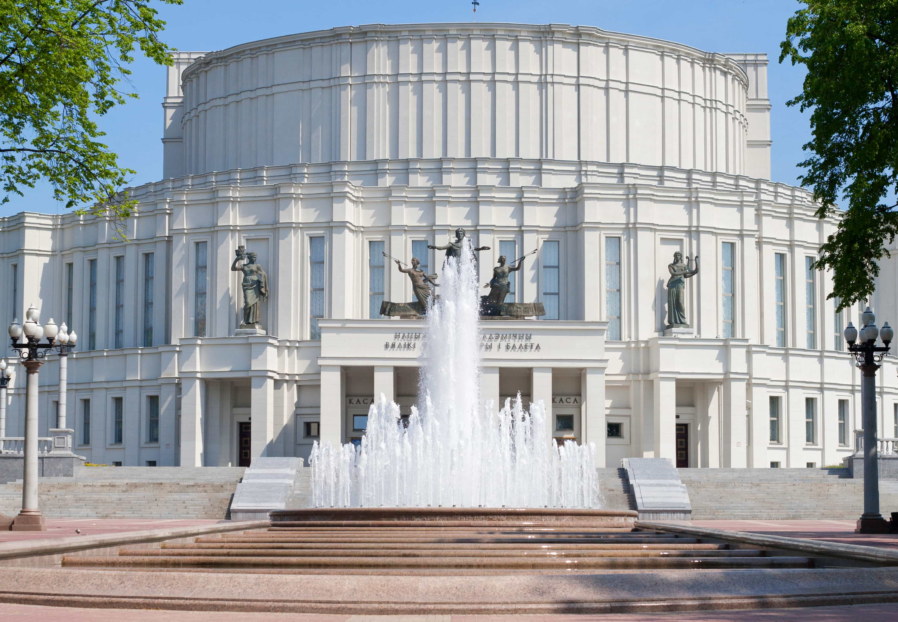
## LE MUSEE DE LA SECONDE GUERRE MONDIALE 
Le musée raconte l'histoire de la Seconde Guerre mondiale. Il possède une riche collection : photographies, documents, armes, munitions, attribut et insignes militaires, afin de raconter la lutte contre les nazis dans un pays qui a fortement été touché par la guerre.

Derrière le musée vous trouvez le parc de la victoire. Cet endroit est idéal pour une promenade dans la nature en plein centre ville. Surtout au printemps et en été ce parc est magnifique. Pendant votre promenade vous verrez des fontaines, un grand lac et ne manquez pas l’île des oiseaux.
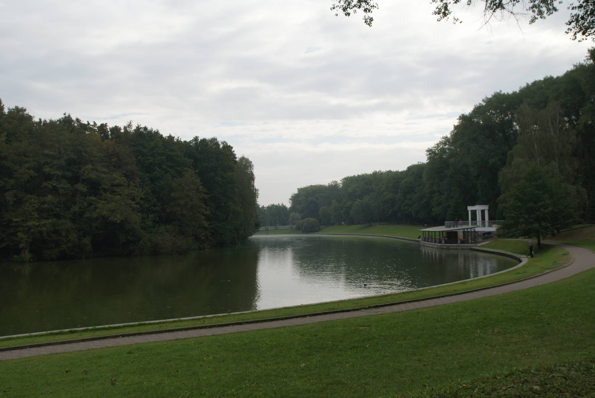
## LE MARCHE KOMAROVSKY 
C’est un marché alimentaire très vivant le plus grand du pays, situé au centre de la ville pas loin de la place de Yakouba Kolasa.
Les prix sont vraiment avantageux et ici vous achetez des produits frais et les produits que vous ne pouvez trouver nulle part ailleurs !
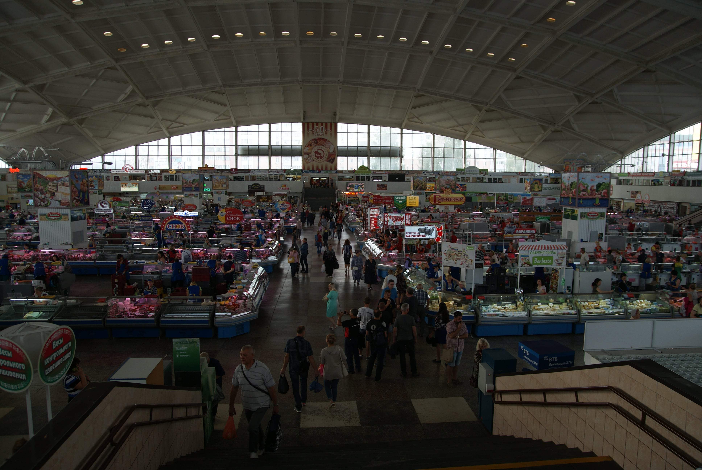